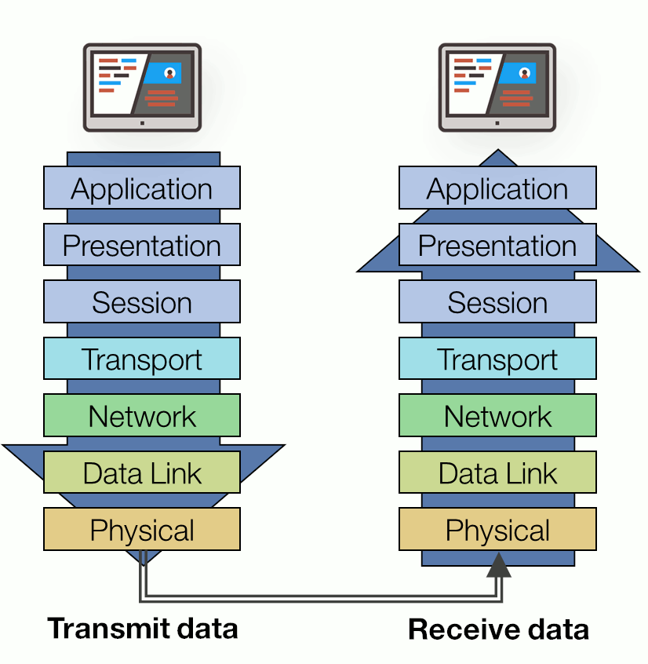

# Protocols

In the case of human affairs protocols are defined as "a system of rules that explain the correct 
conduct and procedures to be followed in formal situations."  For example, lawyers
have a protocol for how the can object in court.  They have to go to school to learn
how to use this protocol and if they don't follow the protocol there on consequences,
for example, they could be found in contempt of court.  

For computers, a **protocol** defines the format and the order of messages exchanged 
between two or more communicating entities, as well as the actions taken on the transmission
and/or receipt of a message or other event.  A protocol ensures computers are all speaking
the same language when communicating even if their internal languages (operating systems
and instruction sets) are vastly different.

# Protocol Layers

{ align=right width=300px }

In the 1970s protocols weren't like they were today.  Each machine had its own protocol,
and thus could only talk to machines of the same model.  This kicked off a period of time
known as [the protocol wars](https://www.computerhistory.org/revolution/networking/19/376). 
By the end of the 1970s it became apparent that we would need interoperable protocols between machine types.
The International Organization for Standardization (ISO) worked for many years on creating
an international standard to unify networking under a common framework.  In 1984 they proposed
the Open Systems Interconnection (OSI) model.

The network designers wanted to create ways that these protocols could build on each other, so
they created a design which organized the protocols in layers.  Each protocol belongs to a layer and the layers
operate in a service model where it can build on the services provided by that layer
beneath it.

!!! example "Example: Sending a File"
    <ol reversed>
    <li>Application Layer (Sender): You decide to send a file using an email application.</li>
    <li>Presentation Layer: The file might be compressed or encoded so that it can be transferred efficiently and to all machine types.</li>
    <li>Session Layer: A connection is established between your computer and the recipient’s computer.</li>
    <li>Transport Layer: The file is broken into smaller packets and given labels to ensure it can be reassembled in the correct order later.</li>
    <li>Network Layer: The packets are given the correct IP address of the destination computer.</li>
    <li>Data Link Layer: The packets are prepared for transfer across the physical network.</li>
    <li>Physical Layer: The data is sent as signals over the network (e.g., electrical signals over Ethernet or wireless signals over Wi-Fi).</li>
    </ol>
    Now, on the receiver's side, it goes back up the layers:
    
    1. Physical Layer: The computer receives the signals.
    2. Data Link Layer: It checks for any errors and passes the data up.
    3. Network Layer: The packets are checked to see if they are meant for this computer based on the IP address.
    4. Transport Layer: The packets are reassembled in the correct order.
    5. Session Layer: The session is managed to ensure all packets are received.
    6. Presentation Layer: The file is decompressed or decoded.
    7. Application Layer: The email client presents the file to the user.

# Hypertext Transfer Protocol

## Secure HTTP

# What is localhost?

### References

Much of this was adapted from the first chapter of Computer Networking: A Top
Down Approach by Kurose and Ross. Online Lectures from this book can be found
[here](https://gaia.cs.umass.edu/kurose_ross/online_lectures.htm).