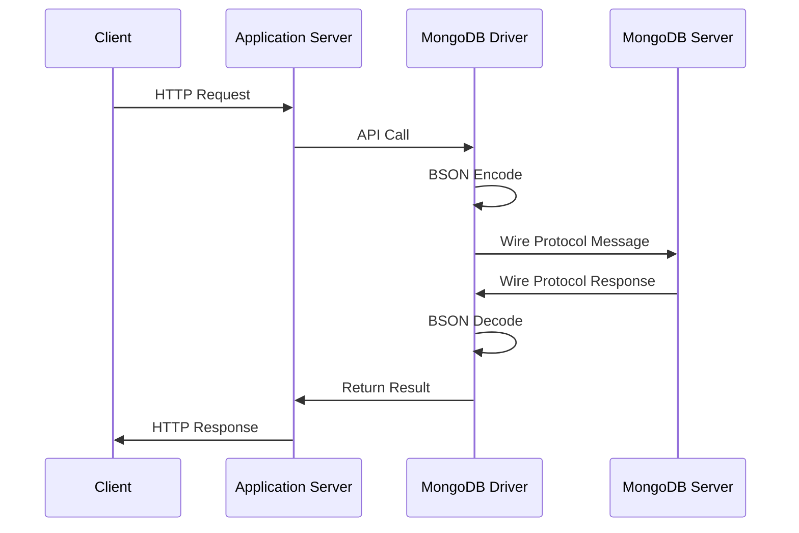

```mermaid
sequenceDiagram
    participant Client
    participant App as Application Server
    participant Driver as MongoDB Driver
    participant Server as MongoDB Server

    Client->>App: HTTP Request
    App->>Driver: API Call
    Driver->>Driver: BSON Encode
    Driver->>Server: Wire Protocol Message
    Server->>Driver: Wire Protocol Response
    Driver->>Driver: BSON Decode
    Driver->>App: Return Result
    App->>Client: HTTP Response
```